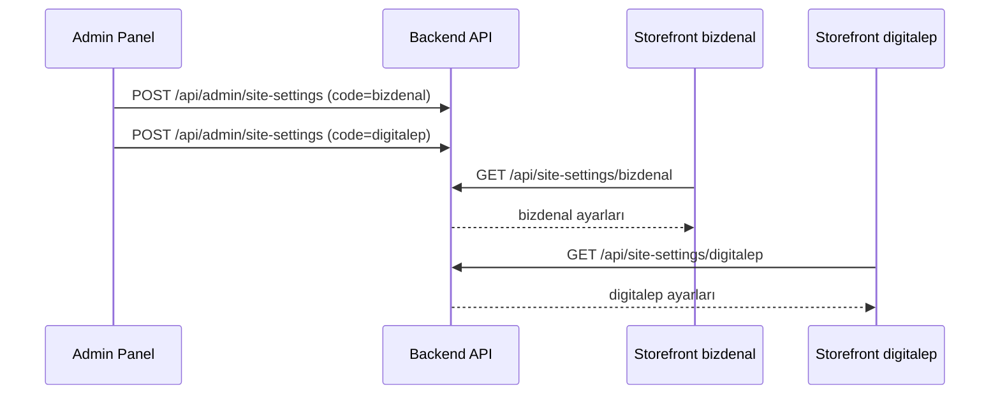

# Storefront UI — Site Ayarları Entegrasyon Rehberi (Çoklu UI)

Bu doküman, **birden fazla storefront UI** projesinin marka, domain, logo, favicon ve iletişim bilgilerini API üzerinden nasıl alacağını açıklar.

Her UI kendi benzersiz **`code`** değeriyle tanımlanır. Admin panelden her UI için ayrı ayar kaydı oluşturulur.

---

## İçindekiler

1. [Genel Bakış](#genel-bakış)
2. [Çoklu UI Modeli](#çoklu-ui-modeli)
3. [API Referansı](#api-referansı)
4. [TypeScript Tipleri](#typescript-tipleri)
5. [Temel Entegrasyon](#temel-entegrasyon)
6. [Ekran Bazlı Kullanım](#ekran-bazlı-kullanım)
7. [Medya URL'leri](#medya-urlleri-logo--favicon)
8. [İletişim Formu](#iletişim-formu)
9. [Önerilen Mimari](#önerilen-mimari)
10. [Fallback ve Hata Yönetimi](#fallback-ve-hata-yönetimi)
11. [Kontrol Listesi](#kontrol-listesi)

---

## Genel Bakış

| Konu | Değer |
|------|-------|
| Birincil endpoint | `GET /api/site-settings/{code}` |
| Varsayılan endpoint | `GET /api/site-settings` ( `isDefault=true` olan kayıt ) |
| Auth | **Gerekmez** (public) |
| UI tanımlayıcı | `.env` → `VITE_UI_CODE=bizdenal` |
| Admin yönetimi | `/admin/site-settings` |

### Akış

```
Admin Panel                    Backend API                  Storefront UI #1 (bizdenal)
─────────────                  ───────────                  ──────────────────────────
UI kodu: bizdenal      →       SiteSettings.Code=bizdenal   VITE_UI_CODE=bizdenal
Logo, iletişim...              GET /api/site-settings/bizdenal

Admin Panel                    Backend API                  Storefront UI #2 (digitalep)
─────────────                  ───────────                  ──────────────────────────
UI kodu: digitalep     →       SiteSettings.Code=digitalep  VITE_UI_CODE=digitalep
Logo, iletişim...              GET /api/site-settings/digitalep
```

---

## Çoklu UI Modeli

Admin panelde her kayıt bir UI instance'ını temsil eder:

| Alan | Açıklama | Örnek |
|------|----------|-------|
| `code` | Storefront'ta kullanılan benzersiz slug | `bizdenal`, `digitalep`, `main-store` |
| `name` | Admin listesinde görünen ad | `Bizden Al Bizden Sat` |
| `siteName` | Sitede görünen marka adı | `bizdenalbizdensat.com` |
| `isActive` | Pasif UI API'den dönmez (404) | `true` |
| `isDefault` | Code belirtilmezse kullanılan kayıt | yalnızca bir tane |

**UI kodu kuralları:** küçük harf, rakam, tire — `^[a-z0-9]+(-[a-z0-9]+)*$`

---

## API Referansı

### `GET /api/site-settings/{code}`

Belirli bir UI'nin ayarlarını getirir. **Her storefront projesi bu endpoint'i kullanmalıdır.**

**İstek:**

```http
GET /api/site-settings/bizdenal
Accept: application/json
```

**Başarılı yanıt (200):**

```json
{
  "success": true,
  "data": {
    "id": "01JXXXX...",
    "code": "bizdenal",
    "name": "Bizden Al Bizden Sat",
    "siteName": "bizdenalbizdensat.com",
    "domain": "https://bizdenalbizdensat.com",
    "logoUrl": "/uploads/site/a1b2c3d4.png",
    "faviconUrl": "/uploads/site/e5f6g7h8.ico",
    "address": "Teknoloji Caddesi No: 123, Dijital Şehir İstanbul, 34001",
    "emails": ["info@example.com", "destek@example.com"],
    "phones": ["+90 (555) 123-4567"],
    "workingHours": ["Pazartesi - Cuma: 09:00 - 18:00"],
    "socialLinks": {
      "facebook": "https://facebook.com/magaza",
      "twitter": "https://x.com/magaza",
      "instagram": "https://instagram.com/magaza",
      "youTube": "https://youtube.com/@magaza"
    },
    "isActive": true,
    "isDefault": false
  }
}
```

**Hata yanıtları:**

| Durum | HTTP | Açıklama |
|-------|------|----------|
| Geçersiz code formatı | 400 | `{ "success": false, "message": "Geçersiz UI kodu" }` |
| Kayıt yok veya pasif | 404 | `{ "success": false, "message": "Site ayarları bulunamadı" }` |

---

### `GET /api/site-settings`

`isDefault=true` olan aktif kaydı döner. Yalnızca tek UI veya geriye dönük uyumluluk için kullanın.

> **Öneri:** Her storefront projesinde `VITE_UI_CODE` tanımlayın; varsayılan endpoint'e güvenmeyin.

---

## TypeScript Tipleri

```typescript
// types/siteSettings.ts

export interface SocialLinks {
  facebook?: string | null;
  twitter?: string | null;
  instagram?: string | null;
  youTube?: string | null;
}

export interface SiteSettings {
  id: string;
  code: string;
  name: string;
  siteName: string;
  domain?: string | null;
  logoUrl?: string | null;
  faviconUrl?: string | null;
  address?: string | null;
  emails: string[];
  phones: string[];
  workingHours: string[];
  socialLinks: SocialLinks;
  isActive: boolean;
  isDefault: boolean;
}

export interface SiteSettingsResponse {
  success: boolean;
  data: SiteSettings;
}
```

---

## Temel Entegrasyon

### 1. Ortam değişkenleri

Her UI projesinin `.env` dosyasında kendi kodu tanımlı olmalı:

```env
# UI #1 — bizdenal projesi
VITE_API_BASE_URL=https://api.example.com/api
VITE_API_ORIGIN=https://api.example.com
VITE_UI_CODE=bizdenal
```

```env
# UI #2 — digitalep projesi
VITE_API_BASE_URL=https://api.example.com/api
VITE_API_ORIGIN=https://api.example.com
VITE_UI_CODE=digitalep
```

> `VITE_UI_CODE` değeri admin panelde oluşturduğunuz **UI kodu** ile birebir eşleşmelidir.

---

### 2. API client

```typescript
// lib/api/siteSettings.ts

const API_BASE_URL = import.meta.env.VITE_API_BASE_URL;
const UI_CODE = import.meta.env.VITE_UI_CODE;

if (!UI_CODE) {
  console.warn("VITE_UI_CODE tanımlı değil — site ayarları alınamaz");
}

export async function fetchSiteSettings(): Promise<SiteSettings> {
  if (!UI_CODE) {
    throw new Error("VITE_UI_CODE ortam değişkeni zorunludur");
  }

  const res = await fetch(`${API_BASE_URL}/site-settings/${UI_CODE}`, {
    headers: { Accept: "application/json" },
  });

  if (!res.ok) {
    throw new Error(`Site ayarları alınamadı (${UI_CODE})`);
  }

  const json: SiteSettingsResponse = await res.json();
  if (!json.success || !json.data) {
    throw new Error("Geçersiz site ayarları yanıtı");
  }

  return json.data;
}
```

---

### 3. React Context

```typescript
// context/SiteSettingsContext.tsx

import { createContext, useContext, useEffect, useState, ReactNode } from "react";
import { fetchSiteSettings } from "@/lib/api/siteSettings";
import type { SiteSettings } from "@/types/siteSettings";

const SiteSettingsContext = createContext<SiteSettings | null>(null);

export function SiteSettingsProvider({ children }: { children: ReactNode }) {
  const [settings, setSettings] = useState<SiteSettings | null>(null);

  useEffect(() => {
    fetchSiteSettings()
      .then((data) => {
        setSettings(data);
        applyBranding(data);
      })
      .catch(console.error);
  }, []);

  return (
    <SiteSettingsContext.Provider value={settings}>
      {children}
    </SiteSettingsContext.Provider>
  );
}

export function useSiteSettings() {
  return useContext(SiteSettingsContext);
}

function applyBranding(settings: SiteSettings) {
  document.title = settings.siteName;
  if (settings.faviconUrl) {
    let link = document.querySelector<HTMLLinkElement>("link[rel='icon']");
    if (!link) {
      link = document.createElement("link");
      link.rel = "icon";
      document.head.appendChild(link);
    }
    link.href = resolveMediaUrl(settings.faviconUrl);
  }
}
```

---

### 4. React Query

```typescript
import { useQuery } from "@tanstack/react-query";
import { fetchSiteSettings } from "@/lib/api/siteSettings";

const UI_CODE = import.meta.env.VITE_UI_CODE;

export function useSiteSettingsQuery() {
  return useQuery({
    queryKey: ["site-settings", UI_CODE],
    queryFn: fetchSiteSettings,
    staleTime: 1000 * 60 * 10,
    enabled: Boolean(UI_CODE),
  });
}
```

> `queryKey`'e `UI_CODE` eklemek, aynı codebase'den farklı UI build'lerinin cache çakışmasını önler.

---

## Ekran Bazlı Kullanım

### Header

```tsx
function Header() {
  const settings = useSiteSettings();

  return (
    <header>
      <a href="/">
        {settings?.logoUrl ? (
          
        ) : (
          <span>{settings?.siteName ?? "Mağaza"}</span>
        )}
      </a>
    </header>
  );
}
```

### İletişim Sayfası

| Sol kolon (API) | Sağ kolon (form) |
|-----------------|------------------|
| `address` | `POST /api/contact` |
| `emails[]` | — |
| `phones[]` | — |
| `workingHours[]` | — |
| `socialLinks` | — |

```tsx
function ContactPage() {
  const { data: settings, isLoading } = useSiteSettingsQuery();
  if (isLoading) return <ContactSkeleton />;

  return (
    <div className="contact-grid">
      <aside>
        <h2>İletişim Bilgileri</h2>
        {settings?.address && <p>{settings.address}</p>}
        {settings?.emails.map((e) => (
          <a key={e} href={`mailto:${e}`}>{e}</a>
        ))}
        {settings?.phones.map((p) => (
          <a key={p} href={`tel:${p.replace(/\s/g, "")}`}>{p}</a>
        ))}
        {settings?.workingHours.map((h) => <p key={h}>{h}</p>)}
        <SocialLinks links={settings?.socialLinks} />
      </aside>
      <ContactForm />
    </div>
  );
}
```

---

## Medya URL'leri (Logo / Favicon)

API göreli path döner; farklı domain'deki storefront için API origin ile birleştirin:

```typescript
const API_ORIGIN = import.meta.env.VITE_API_ORIGIN;

export function resolveMediaUrl(url?: string | null): string {
  if (!url) return "";
  if (url.startsWith("http://") || url.startsWith("https://")) return url;
  return `${API_ORIGIN}${url.startsWith("/") ? url : `/${url}`}`;
}
```

---

## İletişim Formu

Site ayarlarından bağımsızdır; tüm UI'lar aynı endpoint'i kullanır.

```http
POST /api/contact
Content-Type: application/json

{
  "name": "Ahmet Yılmaz",
  "email": "ahmet@example.com",
  "subject": "Konu",
  "message": "Mesaj"
}
```

---

## Önerilen Mimari



**Proje yapısı (monorepo veya ayrı repolar):**

```
storefront-bizdenal/     →  VITE_UI_CODE=bizdenal
storefront-digitalep/    →  VITE_UI_CODE=digitalep
backend-api/             →  tüm UI kayıtları
admin-panel/             →  UI listesi + düzenleme
```

---

## Fallback ve Hata Yönetimi

```typescript
export async function fetchSiteSettingsWithFallback(): Promise<SiteSettings> {
  try {
    return await fetchSiteSettings();
  } catch {
    return {
      id: "",
      code: import.meta.env.VITE_UI_CODE ?? "unknown",
      name: "Fallback",
      siteName: "Mağaza",
      emails: [],
      phones: [],
      workingHours: [],
      socialLinks: {},
      isActive: true,
      isDefault: false,
    };
  }
}
```

| Durum | Davranış |
|-------|----------|
| `VITE_UI_CODE` eksik | Build/runtime uyarısı, fallback site adı |
| 404 (kayıt yok) | Admin'de UI oluşturulmamış — log + fallback |
| `isActive=false` | 404 döner — admin'de aktifleştirin |
| Boş alanlar | İlgili UI bölümünü gizle |

---

## Admin API (referans)

Storefront geliştiricisi için değil; bilgi amaçlı:

| Endpoint | Method | Açıklama |
|----------|--------|----------|
| `/api/admin/site-settings` | GET | Tüm UI listesi |
| `/api/admin/site-settings` | POST | Yeni UI oluştur |
| `/api/admin/site-settings/{id}` | GET | Detay |
| `/api/admin/site-settings/{id}` | PUT | Güncelle |
| `/api/admin/site-settings/{id}` | DELETE | Sil |

---

## Kontrol Listesi

Her storefront UI projesi için:

- [ ] `.env` içinde `VITE_UI_CODE` tanımlı
- [ ] Admin panelde aynı `code` ile UI kaydı oluşturuldu
- [ ] `GET /api/site-settings/{code}` çağrısı yapılıyor
- [ ] Header logo / site adı dinamik
- [ ] Favicon dinamik
- [ ] İletişim sayfası sol kolon API'den besleniyor
- [ ] Medya URL'leri `resolveMediaUrl` ile çözümleniyor
- [ ] React Query kullanılıyorsa `queryKey`'de `UI_CODE` var
- [ ] Production CORS'ta UI domain'i tanımlı

---

## Hızlı Başlangıç

1. Admin → **Site ayarları** → **Yeni UI**
2. UI kodu: `bizdenal` (storefront `.env` ile aynı)
3. Marka ve iletişim bilgilerini doldur → Kaydet
4. Storefront `.env`:
   ```env
   VITE_UI_CODE=bizdenal
   VITE_API_BASE_URL=https://api.example.com/api
   VITE_API_ORIGIN=https://api.example.com
   ```
5. `fetchSiteSettings()` ile entegre et

---

## İlgili Backend Dosyaları

| Dosya | Açıklama |
|-------|----------|
| `src/WebServer/Endpoints/SiteSettings.cs` | Public GET by code |
| `src/WebServer/Endpoints/AdminSiteSettings.cs` | Admin CRUD |
| `src/Application/Settings/SiteSettingsRules.cs` | Code validasyonu |
| `src/AdminWeb/src/pages/SiteSettingsPage.tsx` | UI listesi |
| `src/AdminWeb/src/pages/SiteSettingsFormPage.tsx` | UI düzenleme formu |
