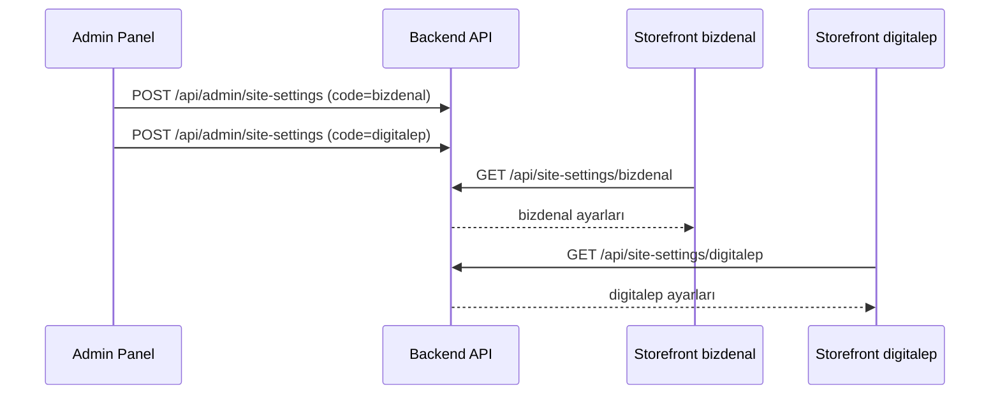

# Storefront UI — Site Ayarları Entegrasyon Rehberi (Çoklu UI)

Bu doküman, **birden fazla storefront UI** projesinin marka, domain, logo, favicon ve iletişim bilgilerini API üzerinden nasıl alacağını açıklar.

Her UI kendi benzersiz **`code`** değeriyle tanımlanır. Admin panelden her UI için ayrı ayar kaydı oluşturulur.

---

## İçindekiler

1. [Genel Bakış](#genel-bakış)
2. [Çoklu UI Modeli](#çoklu-ui-modeli)
3. [API Referansı](#api-referansı)
4. [TypeScript Tipleri](#typescript-tipleri)
5. [Temel Entegrasyon](#temel-entegrasyon)
6. [Ekran Bazlı Kullanım](#ekran-bazlı-kullanım)
7. [Medya URL'leri](#medya-urlleri-logo--favicon)
8. [İletişim Formu](#iletişim-formu)
9. [Ödeme Entegrasyonu Kriterleri (iyzico)](#ödeme-entegrasyonu-kriterleri-iyzico)
10. [Önerilen Mimari](#önerilen-mimari)
11. [Tema ve Light/Dark Mod](#tema-ve-lightdark-mod)
12. [Fallback ve Hata Yönetimi](#fallback-ve-hata-yönetimi)
13. [Kontrol Listesi](#kontrol-listesi)

---

## Genel Bakış

| Konu | Değer |
|------|-------|
| Birincil endpoint | `GET /api/site-settings/{code}` |
| Varsayılan endpoint | `GET /api/site-settings` ( `isDefault=true` olan kayıt ) |
| Auth | **Gerekmez** (public) |
| UI tanımlayıcı | `.env` → `VITE_UI_CODE=bizdenal` |
| Admin yönetimi | `/admin/site-settings` |

### Akış

```
Admin Panel                    Backend API                  Storefront UI #1 (bizdenal)
─────────────                  ───────────                  ──────────────────────────
UI kodu: bizdenal      →       SiteSettings.Code=bizdenal   VITE_UI_CODE=bizdenal
Logo, iletişim...              GET /api/site-settings/bizdenal

Admin Panel                    Backend API                  Storefront UI #2 (digitalep)
─────────────                  ───────────                  ──────────────────────────
UI kodu: digitalep     →       SiteSettings.Code=digitalep  VITE_UI_CODE=digitalep
Logo, iletişim...              GET /api/site-settings/digitalep
```

---

## Çoklu UI Modeli

Admin panelde her kayıt bir UI instance'ını temsil eder:

| Alan | Açıklama | Örnek |
|------|----------|-------|
| `code` | Storefront'ta kullanılan benzersiz slug | `bizdenal`, `digitalep`, `main-store` |
| `name` | Admin listesinde görünen ad | `Bizden Al Bizden Sat` |
| `siteName` | Sitede görünen marka adı | `bizdenalbizdensat.com` |
| `isActive` | Pasif UI API'den dönmez (404) | `true` |
| `isDefault` | Code belirtilmezse kullanılan kayıt | yalnızca bir tane |

**UI kodu kuralları:** küçük harf, rakam, tire — `^[a-z0-9]+(-[a-z0-9]+)*$`

---

## API Referansı

### `GET /api/site-settings/{code}`

Belirli bir UI'nin ayarlarını getirir. **Her storefront projesi bu endpoint'i kullanmalıdır.**

**İstek:**

```http
GET /api/site-settings/bizdenal
Accept: application/json
```

**Başarılı yanıt (200):**

```json
{
  "success": true,
  "data": {
    "id": "01JXXXX...",
    "code": "bizdenal",
    "name": "Bizden Al Bizden Sat",
    "siteName": "bizdenalbizdensat.com",
    "domain": "https://bizdenalbizdensat.com",
    "logoUrl": "/uploads/site/a1b2c3d4.png",
    "faviconUrl": "/uploads/site/e5f6g7h8.ico",
    "address": "Teknoloji Caddesi No: 123, Dijital Şehir İstanbul, 34001",
    "emails": ["info@example.com", "destek@example.com"],
    "phones": ["+90 (555) 123-4567"],
    "workingHours": ["Pazartesi - Cuma: 09:00 - 18:00"],
    "socialLinks": {
      "facebook": "https://facebook.com/magaza",
      "twitter": "https://x.com/magaza",
      "instagram": "https://instagram.com/magaza",
      "youTube": "https://youtube.com/@magaza"
    },
    "paymentCompliance": {
      "legalPages": [
        { "slug": "hakkimizda", "title": "Hakkımızda", "path": "/hakkimizda", "content": "..." },
        { "slug": "gizlilik", "title": "Gizlilik Sözleşmesi", "path": "/gizlilik", "content": "..." }
      ],
      "aboutPageContent": "Mağazamız hakkında...",
      "deliveryReturnsPageContent": "Teslimat süreleri...",
      "privacyPolicyPageContent": "Kişisel veriler...",
      "distanceSellingAgreementPageContent": "Mesafeli satış...",
      "preInformationFormPageContent": "Ön bilgilendirme...",
      "iyzicoPayLogoUrl": "/uploads/site/iyzico-ile-ode.png"
    },
    "paymentComplianceStatus": {
      "completed": 6,
      "total": 6,
      "items": [
        { "key": "aboutPage", "label": "Hakkımızda sayfası", "met": true }
      ]
    },
    "theme": {
      "primaryLight": "#8B5CF6",
      "primaryDark": "#A78BFA",
      "fontFamily": "Inter"
    },
    "isActive": true,
    "isDefault": false
  }
}
```

**Hata yanıtları:**

| Durum | HTTP | Açıklama |
|-------|------|----------|
| Geçersiz code formatı | 400 | `{ "success": false, "message": "Geçersiz UI kodu" }` |
| Kayıt yok veya pasif | 404 | `{ "success": false, "message": "Site ayarları bulunamadı" }` |

---

### `GET /api/site-settings`

`isDefault=true` olan aktif kaydı döner. Yalnızca tek UI veya geriye dönük uyumluluk için kullanın.

> **Öneri:** Her storefront projesinde `VITE_UI_CODE` tanımlayın; varsayılan endpoint'e güvenmeyin.

---

## TypeScript Tipleri

```typescript
// types/siteSettings.ts

export interface SocialLinks {
  facebook?: string | null;
  twitter?: string | null;
  instagram?: string | null;
  youTube?: string | null;
}

export interface SiteLegalPage {
  slug: string;
  title: string;
  path: string;
  content?: string | null;
}

export interface PaymentCompliance {
  legalPages: SiteLegalPage[];
  aboutPageContent?: string | null;
  deliveryReturnsPageContent?: string | null;
  privacyPolicyPageContent?: string | null;
  distanceSellingAgreementPageContent?: string | null;
  preInformationFormPageContent?: string | null;
  iyzicoPayLogoUrl?: string | null;
}

export interface PaymentComplianceItem {
  key: string;
  label: string;
  met: boolean;
}

export interface PaymentComplianceStatus {
  completed: number;
  total: number;
  items: PaymentComplianceItem[];
}

export interface SiteTheme {
  primaryLight?: string | null;
  primaryDark?: string | null;
  fontFamily?: string | null;
}

export interface SiteSettings {
  id: string;
  code: string;
  name: string;
  siteName: string;
  domain?: string | null;
  logoUrl?: string | null;
  faviconUrl?: string | null;
  address?: string | null;
  emails: string[];
  phones: string[];
  workingHours: string[];
  socialLinks: SocialLinks;
  paymentCompliance: PaymentCompliance;
  paymentComplianceStatus: PaymentComplianceStatus;
  theme?: SiteTheme | null;
  isActive: boolean;
  isDefault: boolean;
}

export interface SiteSettingsResponse {
  success: boolean;
  data: SiteSettings;
}
```

---

## Temel Entegrasyon

### 1. Ortam değişkenleri

Her UI projesinin `.env` dosyasında kendi kodu tanımlı olmalı:

```env
# UI #1 — bizdenal projesi
VITE_API_BASE_URL=https://api.example.com/api
VITE_API_ORIGIN=https://api.example.com
VITE_UI_CODE=bizdenal
```

```env
# UI #2 — digitalep projesi
VITE_API_BASE_URL=https://api.example.com/api
VITE_API_ORIGIN=https://api.example.com
VITE_UI_CODE=digitalep
```

> `VITE_UI_CODE` değeri admin panelde oluşturduğunuz **UI kodu** ile birebir eşleşmelidir.

---

### 2. API client

```typescript
// lib/api/siteSettings.ts

const API_BASE_URL = import.meta.env.VITE_API_BASE_URL;
const UI_CODE = import.meta.env.VITE_UI_CODE;

if (!UI_CODE) {
  console.warn("VITE_UI_CODE tanımlı değil — site ayarları alınamaz");
}

export async function fetchSiteSettings(): Promise<SiteSettings> {
  if (!UI_CODE) {
    throw new Error("VITE_UI_CODE ortam değişkeni zorunludur");
  }

  const res = await fetch(`${API_BASE_URL}/site-settings/${UI_CODE}`, {
    headers: { Accept: "application/json" },
  });

  if (!res.ok) {
    throw new Error(`Site ayarları alınamadı (${UI_CODE})`);
  }

  const json: SiteSettingsResponse = await res.json();
  if (!json.success || !json.data) {
    throw new Error("Geçersiz site ayarları yanıtı");
  }

  return json.data;
}
```

---

### 3. React Context

```typescript
// context/SiteSettingsContext.tsx

import { createContext, useContext, useEffect, useState, ReactNode } from "react";
import { fetchSiteSettings } from "@/lib/api/siteSettings";
import type { SiteSettings } from "@/types/siteSettings";

const SiteSettingsContext = createContext<SiteSettings | null>(null);

export function SiteSettingsProvider({ children }: { children: ReactNode }) {
  const [settings, setSettings] = useState<SiteSettings | null>(null);

  useEffect(() => {
    fetchSiteSettings()
      .then((data) => {
        setSettings(data);
        applyBranding(data);
      })
      .catch(console.error);
  }, []);

  return (
    <SiteSettingsContext.Provider value={settings}>
      {children}
    </SiteSettingsContext.Provider>
  );
}

export function useSiteSettings() {
  return useContext(SiteSettingsContext);
}

function applyBranding(settings: SiteSettings) {
  document.title = settings.siteName;
  if (settings.faviconUrl) {
    let link = document.querySelector<HTMLLinkElement>("link[rel='icon']");
    if (!link) {
      link = document.createElement("link");
      link.rel = "icon";
      document.head.appendChild(link);
    }
    link.href = resolveMediaUrl(settings.faviconUrl);
  }
}
```

---

### 4. React Query

```typescript
import { useQuery } from "@tanstack/react-query";
import { fetchSiteSettings } from "@/lib/api/siteSettings";

const UI_CODE = import.meta.env.VITE_UI_CODE;

export function useSiteSettingsQuery() {
  return useQuery({
    queryKey: ["site-settings", UI_CODE],
    queryFn: fetchSiteSettings,
    staleTime: 1000 * 60 * 10,
    enabled: Boolean(UI_CODE),
  });
}
```

> `queryKey`'e `UI_CODE` eklemek, aynı codebase'den farklı UI build'lerinin cache çakışmasını önler.

---

## Ekran Bazlı Kullanım

### Header

```tsx
function Header() {
  const settings = useSiteSettings();

  return (
    <header>
      <a href="/">
        {settings?.logoUrl ? (
          
        ) : (
          <span>{settings?.siteName ?? "Mağaza"}</span>
        )}
      </a>
    </header>
  );
}
```

### İletişim Sayfası

| Sol kolon (API) | Sağ kolon (form) |
|-----------------|------------------|
| `address` | `POST /api/contact` |
| `emails[]` | — |
| `phones[]` | — |
| `workingHours[]` | — |
| `socialLinks` | — |

```tsx
function ContactPage() {
  const { data: settings, isLoading } = useSiteSettingsQuery();
  if (isLoading) return <ContactSkeleton />;

  return (
    <div className="contact-grid">
      <aside>
        <h2>İletişim Bilgileri</h2>
        {settings?.address && <p>{settings.address}</p>}
        {settings?.emails.map((e) => (
          <a key={e} href={`mailto:${e}`}>{e}</a>
        ))}
        {settings?.phones.map((p) => (
          <a key={p} href={`tel:${p.replace(/\s/g, "")}`}>{p}</a>
        ))}
        {settings?.workingHours.map((h) => <p key={h}>{h}</p>)}
        <SocialLinks links={settings?.socialLinks} />
      </aside>
      <ContactForm />
    </div>
  );
}
```

---

## Medya URL'leri (Logo / Favicon)

API göreli path döner; farklı domain'deki storefront için API origin ile birleştirin:

```typescript
const API_ORIGIN = import.meta.env.VITE_API_ORIGIN;

export function resolveMediaUrl(url?: string | null): string {
  if (!url) return "";
  if (url.startsWith("http://") || url.startsWith("https://")) return url;
  return `${API_ORIGIN}${url.startsWith("/") ? url : `/${url}`}`;
}
```

---

## Ödeme Entegrasyonu Kriterleri (iyzico)

Yasal sayfalar **admin’den girilen içerikle** API üzerinden dinamik yayınlanır. Sabit slug’lar:

| Sayfa | Slug | Storefront yolu |
|-------|------|-----------------|
| Hakkımızda | `hakkimizda` | `/hakkimizda` |
| Ön bilgilendirme formu | `on-bilgilendirme-formu` | `/on-bilgilendirme-formu` |
| Teslimat ve iade | `teslimat-ve-iade` | `/teslimat-ve-iade` |
| Gizlilik | `gizlilik` | `/gizlilik` |
| Mesafeli satış | `mesafeli-satis` | `/mesafeli-satis` |

### Public API — tek sayfa

```http
GET /api/site-settings/{code}/legal-pages/{slug}
```

Örnek: `GET /api/site-settings/bizdenalbizdensat/legal-pages/on-bilgilendirme-formu`

```json
{
  "success": true,
  "data": {
    "slug": "hakkimizda",
    "title": "Hakkımızda",
    "path": "/hakkimizda",
    "content": "Mağazamız...",
    "siteName": "bizdenalbizdensat.com",
    "code": "bizdenal"
  }
}
```

### Hazır HTML (önizleme / crawler)

```http
GET /api/site-settings/{code}/legal-pages/{slug}/html
```

### Storefront — React Router

```tsx
const LEGAL_SLUGS = ["hakkimizda", "on-bilgilendirme-formu", "teslimat-ve-iade", "gizlilik", "mesafeli-satis"] as const;

function LegalPage({ slug }: { slug: string }) {
  const UI_CODE = import.meta.env.VITE_UI_CODE;
  const { data } = useQuery({
    queryKey: ["legal-page", UI_CODE, slug],
    queryFn: async () => {
      const res = await fetch(`${API_BASE_URL}/site-settings/${UI_CODE}/legal-pages/${slug}`);
      const json = await res.json();
      return json.data;
    },
  });

  if (!data?.content) return <NotFound />;
  return (
    <article>
      <h1>{data.title}</h1>
      <div dangerouslySetInnerHTML={{ __html: data.content }} />
    </article>
  );
}

// routes: /hakkimizda, /gizlilik, ...
```

`GET /api/site-settings/{code}` yanıtında ayrıca `paymentCompliance.legalPages[]` ve düz `*PageContent` alanları bulunur.

### Footer örneği

```tsx
function PaymentFooter() {
  const settings = useSiteSettings();
  const pages = settings?.paymentCompliance?.legalPages ?? [];
  const iyzicoLogo = settings?.paymentCompliance?.iyzicoPayLogoUrl;

  return (
    <footer>
      <nav>
        {pages.filter((p) => p.content).map((p) => (
          <Link key={p.slug} to={p.path}>{p.title}</Link>
        ))}
      </nav>
      {/* logolar */}
    </footer>
  );
}
```

Admin değişikliği sonrası: `cd src/AdminWeb && npm run build`

---

## İletişim Formu

Site ayarlarından bağımsızdır; tüm UI'lar aynı endpoint'i kullanır.

```http
POST /api/contact
Content-Type: application/json

{
  "name": "Ahmet Yılmaz",
  "email": "ahmet@example.com",
  "subject": "Konu",
  "message": "Mesaj"
}
```

---

## Önerilen Mimari



**Proje yapısı (monorepo veya ayrı repolar):**

```
storefront-bizdenal/     →  VITE_UI_CODE=bizdenal
storefront-digitalep/    →  VITE_UI_CODE=digitalep
backend-api/             →  tüm UI kayıtları
admin-panel/             →  UI listesi + düzenleme
```

---

## Tema ve Light/Dark Mod

Her UI kaydı için admin panelden **ayrı bir renk teması** tanımlanabilir. Storefront bu renkleri CSS değişkenlerine (`--primary`, `--ring`, `--theme-gradient`) uygular.

### API — `theme` alanı

| Alan | Açıklama | Örnek |
|------|----------|-------|
| `theme.primaryLight` | Açık mod ana rengi (hex) | `#8B5CF6` |
| `theme.primaryDark` | Koyu mod ana rengi (hex) | `#A78BFA` |
| `theme.fontFamily` | Font ailesi | `Inter` |

Boş bırakılırsa storefront varsayılan mor tema kullanılır.

### Admin panel

**Site ayarları → UI Düzenle → Tema** bölümünden:

- Açık/koyu mod ana renkleri (renk seçici + hex)
- Font ailesi

### Storefront — light/dark geçişi

Navbar'daki güneş/ay butonu `next-themes` ile `html` elementine `.dark` sınıfı ekler/kaldırır. Kullanıcı tercihi `localStorage`'da saklanır.

`SiteSettingsContext` API'den gelen `theme` değerlerini uygular:

```typescript
// contexts/SiteSettingsContext.tsx — applyTheme()
// hex → HSL dönüşümü → :root ve .dark CSS değişkenleri
applyTheme(settings.theme);
```

### Çoklu UI örneği

| UI kodu | primaryLight | primaryDark |
|---------|--------------|-------------|
| `bizdenal` | `#8B5CF6` (mor) | `#A78BFA` |
| `digitalep` | `#2563EB` (mavi) | `#60A5FA` |

Her storefront `VITE_UI_CODE` ile kendi temasını alır; aynı codebase farklı build'lerle farklı markalar sunabilir.

---

## Fallback ve Hata Yönetimi

```typescript
export async function fetchSiteSettingsWithFallback(): Promise<SiteSettings> {
  try {
    return await fetchSiteSettings();
  } catch {
    return {
      id: "",
      code: import.meta.env.VITE_UI_CODE ?? "unknown",
      name: "Fallback",
      siteName: "Mağaza",
      emails: [],
      phones: [],
      workingHours: [],
      socialLinks: {},
      isActive: true,
      isDefault: false,
    };
  }
}
```

| Durum | Davranış |
|-------|----------|
| `VITE_UI_CODE` eksik | Build/runtime uyarısı, fallback site adı |
| 404 (kayıt yok) | Admin'de UI oluşturulmamış — log + fallback |
| `isActive=false` | 404 döner — admin'de aktifleştirin |
| Boş alanlar | İlgili UI bölümünü gizle |

---

## Admin API (referans)

Storefront geliştiricisi için değil; bilgi amaçlı:

| Endpoint | Method | Açıklama |
|----------|--------|----------|
| `/api/admin/site-settings` | GET | Tüm UI listesi |
| `/api/admin/site-settings` | POST | Yeni UI oluştur |
| `/api/admin/site-settings/{id}` | GET | Detay |
| `/api/admin/site-settings/{id}` | PUT | Güncelle |
| `/api/admin/site-settings/{id}` | DELETE | Sil |

---

## Kontrol Listesi

Her storefront UI projesi için:

- [ ] `.env` içinde `VITE_UI_CODE` tanımlı
- [ ] Admin panelde aynı `code` ile UI kaydı oluşturuldu
- [ ] `GET /api/site-settings/{code}` çağrısı yapılıyor
- [ ] Header logo / site adı dinamik
- [ ] Favicon dinamik
- [ ] İletişim sayfası sol kolon API'den besleniyor
- [ ] Admin'de yasal sayfa içerikleri ve logolar dolduruldu (6/6)
- [ ] Storefront'ta `/hakkimizda` vb. rotalar API içeriğini gösteriyor
- [ ] Footer'da yasal sayfa linkleri ve ödeme logoları `paymentCompliance`'ten
- [ ] Medya URL'leri `resolveMediaUrl` ile çözümleniyor
- [ ] React Query kullanılıyorsa `queryKey`'de `UI_CODE` var
- [ ] Admin'de tema renkleri tanımlandı (isteğe bağlı)
- [ ] Storefront'ta light/dark toggle çalışıyor
- [ ] Production CORS'ta UI domain'i tanımlı

---

## Hızlı Başlangıç

1. Admin → **Site ayarları** → **Yeni UI**
2. UI kodu: `bizdenalbizdensat` (storefront `.env` ile aynı; [bizdenalbizdensat.com](https://www.bizdenalbizdensat.com/))
3. Marka, iletişim ve **yasal form içerikleri** (admin formundan manuel) → Kaydet
4. Storefront `.env`:
   ```env
   VITE_UI_CODE=bizdenalbizdensat
   VITE_API_BASE_URL=https://api.example.com/api
   VITE_API_ORIGIN=https://api.example.com
   ```
5. `fetchSiteSettings()` ile entegre et

---

## İlgili Backend Dosyaları

| Dosya | Açıklama |
|-------|----------|
| `src/WebServer/Endpoints/SiteSettings.cs` | Public GET by code |
| `src/WebServer/Endpoints/AdminSiteSettings.cs` | Admin CRUD |
| `src/Application/Settings/SiteSettingsRules.cs` | Code validasyonu |
| `src/Application/Settings/PaymentComplianceRules.cs` | iyzico kriter durumu |
| `src/Application/Settings/SiteLegalPages.cs` | Sabit slug / sayfa eşlemesi |
| `src/AdminWeb/src/pages/SiteSettingsPage.tsx` | UI listesi |
| `src/AdminWeb/src/pages/SiteSettingsFormPage.tsx` | UI düzenleme formu |
